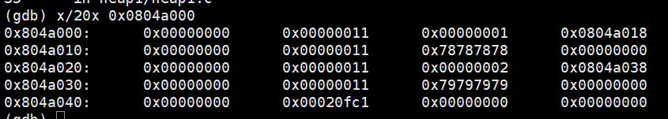

# Exploit Exercises Heap1
## code
```
#include <stdlib.h>
#include <unistd.h>
#include <string.h>
#include <stdio.h>
#include <sys/types.h>

struct internet {
    int priority;
    char *name;
};

void winner()
{
    printf("and we have a winner @ %d\n", time(NULL));
}

int main(int argc, char **argv)
{
    struct internet *i1, *i2, *i3;

    i1 = malloc(sizeof(struct internet));
    i1->priority = 1;
    i1->name = malloc(8);

    i2 = malloc(sizeof(struct internet));
    i2->priority = 2;
    i2->name = malloc(8);

    strcpy(i1->name, argv[1]);
    strcpy(i2->name, argv[2]);

    printf("and that's a wrap folks!\n");
}
```
## Principle
First of all,we need to understand the basic concept of heap:

**The heap is pool of memory used for dynamic allocations at runtime.**
(Quoted from http://security.cs.rpi.edu/courses/binexp-spring2015/lectures/17/10_lecture.pdf)

There are many kinds of heap implementations, and I will use **ptmalloc2** to describe heap. The most important function of heap is malloc and free. After malloc, a memory space is ready to be uesd, named **chunk**.


Prev chunk size stores the size of last chunk.

Current chunk size stores the size of current chunk,including size of header.We can see that it's divided into two parts in that memory unit.Because chunk is 8 bytes aligned (16 bytes in 64-bit computer), the lowest 3 bits are always zero. Taking advantage of these 3 bits as flag reduces waste of memory space. Another thing I need to mention is that if prev chunk is uesd, the prev chunk size keeps zero in current.

To reduce more waste, if we malloc 0x20 bytes for a chunk, it will get 0x24,instead of 0x32 as we assumed.(including header) That's because if we are using that chunk, the next chunk's **Prev chunk size** must be zero, which means we can use that memory unit,too.

## Test

I make serval breakpoints after all **malloc** function to monitor what exactly happen in main arena.


After first malloc function, we can see that a 0x10-size chunk was created.(0x0804a000-0x0804a00f) chunk 0x084a010 is the **top chunk** in main arena. Calling the first malloc makes it exist. Atfer that, every new chunk is divided from it. We can see that the original size of top chunk is probably 0x21000.


Calling the second malloc, there are one more chunk now(0x0804a010). Different from stack,heap grows from lower to higher address. At that time,**i1->priority = 1** has been executed,so [0x0804a000+0x8] is 1.


Before the third malloc, program assigns i1->name with the chunk created after the second malloc. So we can find that [0x0804a000+0xc] becomes the address of second chunk.(address of data). Like the first malloc, the third malloc creates a chunk for i2.


That is all chunk the program calls malloc to create.But not any byte fills up right after malloc.



At the end of program, everything is ready now. i1->name points to 0x0804a018 and i2->name points to 0x0804a038.

The way to execute **winner** function is that we overflow i1->name (strcpy do not verify if length of src is out of dst's range) and change address of i2->name ([0x0804a02c]) into stack address storing ret address.After that, we can write the address of winner at the second strcpy. As we already change i2->name's address into stored-ret-address stack address, when program returns, it will execute winner!


winner address => 0x8048494

stack:ret => 0xbffff79c


i2->name changed as we wished.

## More
