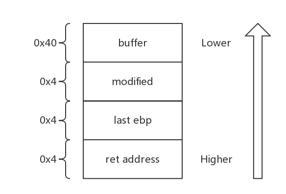
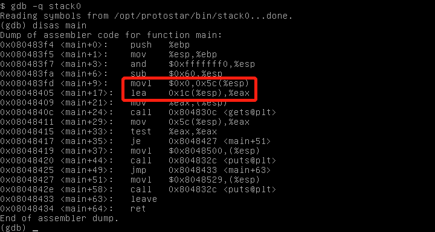
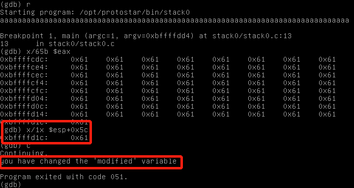
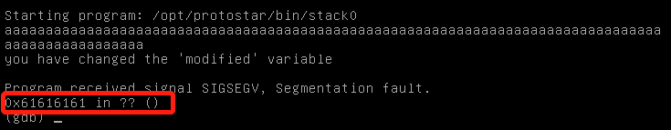

# Exploit Exercises Stack0
## code
```
#include <stdlib.h>
#include <unistd.h>
#include <stdio.h>  

int main(int argc, char **argv) {   
   volatile int modified;   
   char buffer[64];   
   modified = 0;  

   gets(buffer);   

   if(modified != 0) {    
     printf("you have changed the 'modified' variable\n");
   }
   else {   
    printf("Try again?\n");  
  }
}

```
## Principle
Function "gets" do not examine the length of data you enter, so if you enter more data than the argument actually has, you exploit stack.
The earlier defined variable locates in the lower address in stack. If you enter more than 64 bytes data into variable "buffer", the overflow bytes will cover the higher address of stack.



## Test



As we can see in the picture, buffer locates in **\$esp+0x1c** and modified locates in **\$esp+0x5c**. We can set a breakpoint in \*main+29 (right after the "gets" function) and run.



Now we stop at breakpoint 1. We can find that address **\$esp+0x5c** has changed from 0x0 to 0x61,meaning that we have overflow modified :D.

## Summary

We can actually enter more data , change ret address and do more things.


