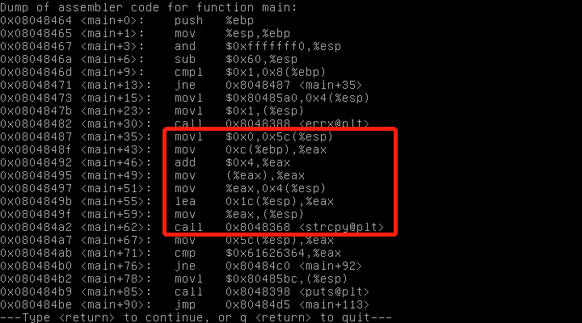

# Exploit Exercises Stack0
## code
```
#include <stdlib.h>
nclude <unistd.h>
nclude <stdio.h>
nclude <string.h>
int main(int argc, char **argv)
{
  volatile int modified;
  char buffer[64];
  if(argc == 1) {
    errx(1, "please specify an argument\n");
  }

  modified = 0;
  strcpy(buffer, argv[1]);

  if(modified == 0x61626364) {
    printf("you have correctly got the variable to the right value\n");
  } else {
    printf("Try again, you got 0x%08x\n", modified);
  }
}

```
## Principle
Function "strcpy" do not examine the length of data you enter, so if you enter more data into the second argument than the first argument actually has, you exploit stack.
We just need to enter 68 bytes' data into command argument argv[1], and set the last 4 bytes as "dcba".

## Test



As we can see in the picture, argv[1] locates in **\$ebp+0xc** and was set in \$esp+4. variable "buffer" locates in **\$esp+0x1c** and was set in $esp.
Set a breakpoint at \*main+67 and run the program.


Now we stop at breakpoint 0. Address **\$esp+0x1c** has overflowed and covered the original data of "modified". Cover the last 4 bytes as "dcba", we meet the condition to print "you have correctly got the variable to the right value\n".

## Summary

Using **\`python -c \"print \'a\'\*0xXX... \"**  imporves efficiency.


