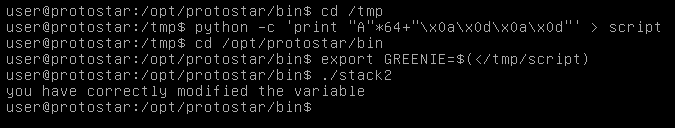

# Exploit Exercises Stack2
## code
```

#include <stdlib.h>
#include <unistd.h>
#include <stdio.h>
#include <string.h>

int main(int argc, char **argv)
{
    volatile int modified;
    char buffer[64];
    char *variable;

    variable = getenv("GREENIE");

    if(variable == NULL) {
        errx(1, "please set the GREENIE environment variable\n");
    }

    modified = 0;

    strcpy(buffer, variable);

    if(modified == 0x0d0a0d0a) {
        printf("you have correctly modified the variable\n");
    } else {
        print("Try again, you got 0x%08x\n", modified);
    }

}

```
## Principle
Stack2 is similar to stack1,except that we need to create an environment variable and write **"\x0a\x0d\x0a\0x0d"** as the last 4 bytes.

## Test

Just the other way using python to imporve efficiency  in Stack1 Summary, we can use '>' and '<' as input:



## Summary
