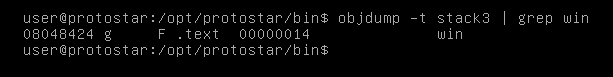
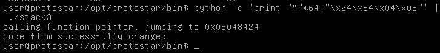
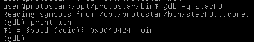

# Exploit Exercises Stack3
## code
```

#include <stdlib.h>
#include <unistd.h>
#include <stdio.h>
#include <string.h>

void win()
{
    printf("code flow successfully changed\n");
}

int main(int argc, char **argv)
{
    volatile int (*fp)();
    char buffer[64];

    fp = 0;

    gets(buffer);

    if(fp) {
        printf("calling function pointer, jumping to 0x%08x\n", fp);
        fp();
    }
}

```
## Principle

Stack2 requires us to write **"\x0a\x0d\x0a\0x0d"** as the last 4 bytes (4 in 68 bytes), and this time we need to write the address of function **"win"** to pointer **fp**, which will be call if not NULL. We can use objdump - an  Unix-like systems' tool.  **objdump is a program for displaying various information about object files on Unix-like systems.**,quoted from Wikipedia.

## Test

objdump -t (--syms) can print the symbol table entries of the file.



Address of "win" is **0x08048424**, and we need to transfer it into **little-endian**, which is **"\\x24\\x84\\x04\\x08"**.

So, writing "A"\*64+"\\x24\\x84\\x04\\x08" into program, pleasures us like a girlfriend.



## Summary

objdump has many other useful options:

option | function
:-: | :-:
-t | Print the symbol table entries of the file
-S | Display source code intermixed with disassembly, if possible.
-h | Display summary information from the section headers of the object file.
-d | Display the assembler mnemonics for the machine instructions from objfile.
...| ...

We can also use **print win** to get the address of win in gdb.


