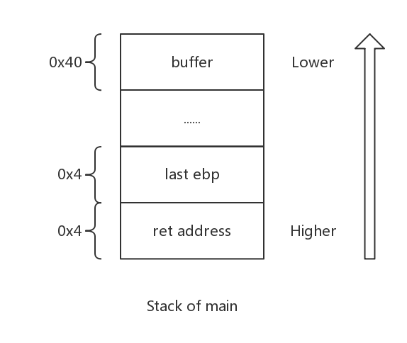
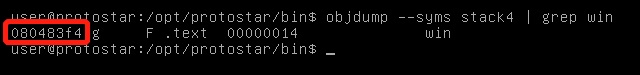
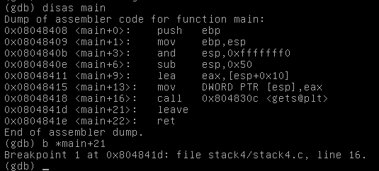
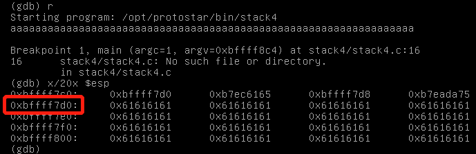
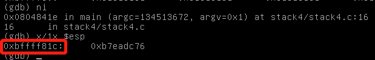
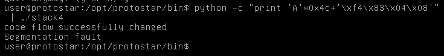

# Exploit Exercises Stack4
## code
```

#include <stdlib.h>
#include <unistd.h>
#include <stdio.h>
#include <string.h>

void win()
{
    printf("code flow successfully changed\n");
}

int main(int argc, char **argv)
{
    char buffer[64];

    gets(buffer);
}

```
## Principle

Looking at the code, we can find that there is nothing but only two functions. There are no pointers/local variables for us to overflow and call like Stack3. But if you have learned some knowledge about **Calling Convention**, you will find it as easy as Russell Westbrook makes a triple-double.

<font color="#000066">A calling convention is an implementation-level (low-level) scheme for how subroutines receive parameters from their caller and how they return a result.
Quoted from Wikipedia</font><br/>

there are serval kind of calling convention, and they have similar stack frame. As we have mentioned before, a ret address will be written into top of stack as soon as the **call** instruction is executed.



That means we can write more than 64 bytes to overflow **last ebp** and write function **win**'s address into ret address. Excuting all instructions of function main, System will pop ret address from stack and jump.

## Test

objdump -t (--syms) can print the symbol table entries of the file.

Use **objdump -t (--syms)** to find out address of function **win**.



Then, we need to cover **last ebp** and write **ret address**, which is **"\xf4\x83\x04\x08"**.

Use gdb to display assembly code, we can set a breakpoint at **main+21**:



Run it and write something. When it stops at breakpoint, we can find out the start of **buffer** in stack:



Local variable Buffer starts at **0xbffff7d0**, and we can execute one more instruction to main+22, where we can verify the ret address:



Ret address locates at **0xbffff81c**. We can calculate how many data we need to fill now:
$$0xbffff81c-0xbffff7d0 = 0x4c $$

Hack:



## Summary

The reason why "Segmentation fault" is that we change ebp, breaking down the outer function of main.
