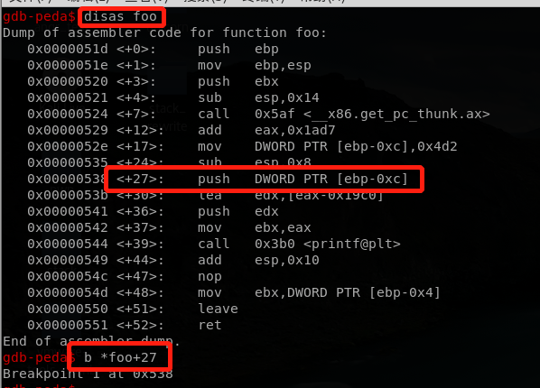
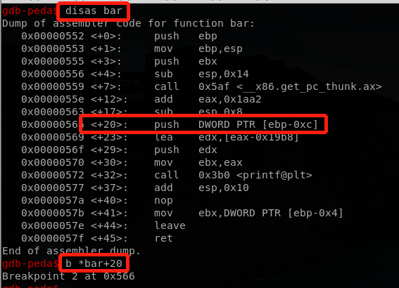
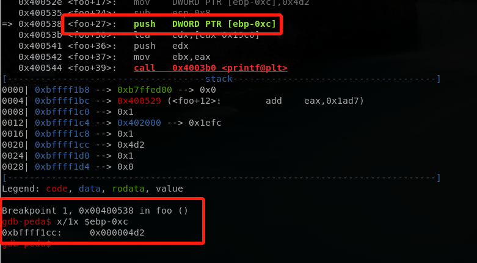
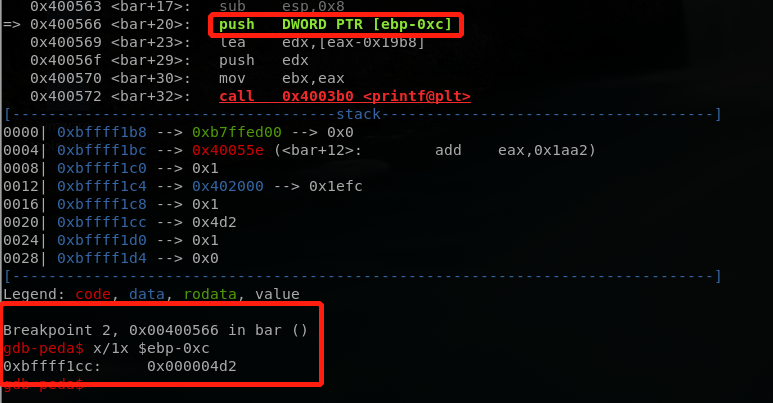

# **Stack Reuse**
## Principle
一个简单的栈复用情况:两个调用顺序相邻的函数很可能会复用栈，而函数栈在函数借宿后并没有删除其中内容，所以导致下一个函数可能可以复用上一个函数的内容。
## Test
写一段简单的代码如下:
```
#include<stdio.h>

void foo()
{
  int a = 1234;
  printf("a = %d\n",a);
}

void bar()
{
  int b;
  printf("b = %d\n",b);
}
void main()
{
  foo();
  bar();
}
```
先执行一遍查看结果:


可以看到，在foo函数中为a赋值了，bar中未给b赋值，但是结果却显示b的值与a相同，说明栈复用成功。

使用gdb调试(peda插件)，查看foo的汇编代码，并在printf传入第一个参数的代码处下断点:



同理，查看bar的汇编代码，并在printf传入第一个参数的代码处下断点:



接下来就可以执行程序到断点处。程序首先断在foo函数中，查看相应的ebp-0xc的地址:



可以看到ebp-0xc的(本次)地址为0xbffff1cc,值为0x4d2(十进制1234)。

让程序继续跑起来，程序断在了bar函数中。查看此时对应的ebp-0x的地址:



可以看到此时的ebp-0xc的地址与foo中一样!所以虽然bar中未为变量b赋值，但是由于使用的地址一样，所以b的值也为0x4d2。

## More
这样的缺陷算不上计算机漏洞，但是可以为漏洞服务。CVE-2014-3135是2014年被发现的一个安卓内核漏洞，在其中需要使用上述缺陷，使得一个特定的链表指针可以在其它函数中被重复使用，是黑客利用该漏洞提权的重要环节。上述缺陷可能还可以在更多场景中被利用，期望有朝一日能够发现。
