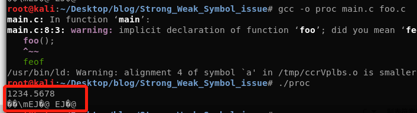
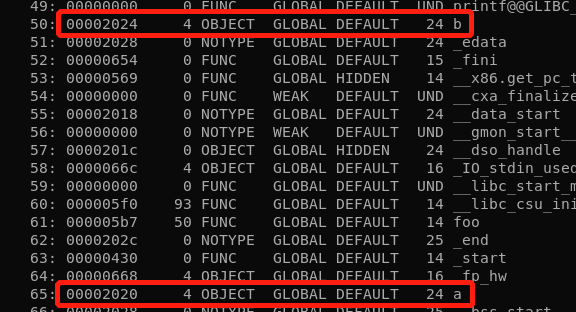
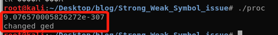
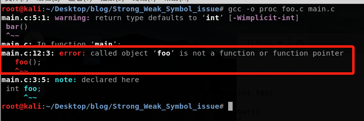

# Strong and Weak Symbol Issue
## Principle
在Linux系统中(其它OS可能也相同)，一个程序的编写可以由多个模块组成。每个模块都有自己的函数、静态变量和全局变量。Linux编译系统会为每一个全局符号定义一个强弱属性:
如果全局符号是函数或者已分配值的全局变量，则其属性为强符号;如果全局符号是未分配值得全局符号，则属性为弱符号。
当一个符号在一个模块中为强符号，而在其它模块中为弱符号，则编译系统选择强符号作为最终的符号。这种情况下，其它弱符号的修改均会影响强符号的值，反之不然。
## Test
编写两个模块: main.c和foo.c
```
//main.c
#include<stdio.h>

char a[] = "bad";
char b[] = "boy";

void main()
{
  foo();
  printf("%s %s\n",a,b);
}
```
```
//foo.c
#include<stdio.h>

double a;

void foo()
{
  scanf("%lf",&a);
}
```
编译、执行并随便输入一些东西，查看结果:



可以看到a的值被修改了,但是本应该输出字符串"boy"的b也被修改为乱码了。回过头来想一想，在main.c中我们设置a为4个字节长度的字符串(包含字符串结尾'\0')，而在bar中a却是8个字节长度的双精度double型，那么在foo中为a赋值的话就会修改main.c中的强符号a，而a、b在.data中相邻，所以b也会受到影响。

a、b在.data中的偏移量:



上面的乱码不太好看，我们可以“精心构造”出一个双精度数，从而显示出一个“视觉友好性”字符串。
经过不懈努力和google，终于构造了字符串"changed"的浮点数:
9.076570005826272e-307

将其输入，便可得到新结果:



##More
本来想试一下可不可以强符号函数被弱符号变量修改从而可以通过修改变量来修改函数入口地址，但是貌似行不通，可能有别的方法吧。

失败的尝试:


