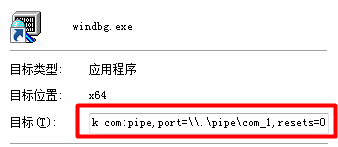
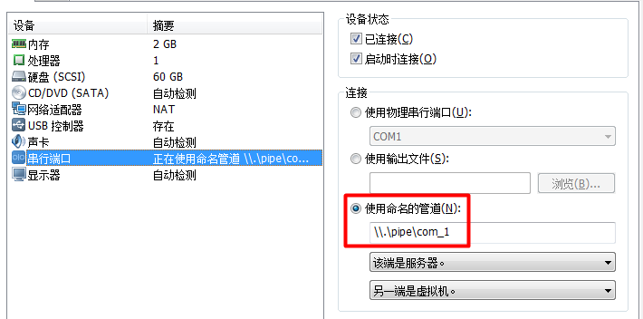
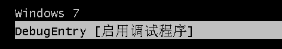
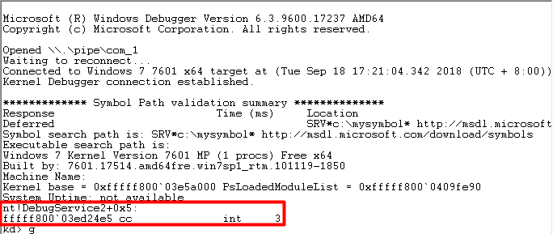

# Windbg Learning Note
## Load MS Symbol for Windbg
### Step0
Add **Windbg directory** to Path in System Environment Variable.
### Step1
Create new System Environment Variable:

Name | Value
:-: | :-:
\_NT\_SYMBOL\_PATH | SRV\*c:\mysymbol\* http://msdl.microsoft.com/download/symbols

### Step2
Reboot System.

## Using Windbg to debug VM Kernel
### Step0
Download Windbg,vmware and a system mirror.
### Step1
Create a .lnk for Windbg, set target as **{Windbg directory}\windbg.exe -b -k com:pipe,port=\\.\pipe\com_1,resets=0**:

### Step2
Create a new Serial Port for VM and set as named pipe: **\\\\.\\pipe\\com_1**

### Step3
Run VM, execute cmd.exe as **Administrator**, enter **bcdedit** and add string:
```
bcdedit /dbgsettings serial baudrate:115200 debugport:1
bcdedit /copy {current} /d DebugEntry ; an {ID} will be created after this instruction
bcdedit /displayorder {current} {ID}
bcdedit /debug {ID} ON
```
### Step4
OK,now reboot VM,you will found a new option for booting system, choice it and run windbg(as fast as you can :D ):


### Step5
Now Windbg breaks down the system:

## Windbg Basic Instruction
Instruction | Function
:-: | :-:
bp | Set breakpoint
bl | Display breakpoint list
bc (num) | Clear breakpoint (num)
bd | Disable breakpoint
be | Enable breakpoint
d(b/w/d/q) (addr)| Display byte/word/dword qword in address
g | Continue to execute
k | Display call stack
lm | Display list of moudles loaded by system
r | Display all registers' value
u | Disassemble
uf | Disassemble the whole function
x | Examine
crtl+break | Break process
F10/p | Step over
F11/t | Step into

## Breakpoint Advanced Tech
Instruction | Function
:-: | :-:
bp (addr) ".printf \"0x%x \\\\n\",rax; g"|  Display breakpoint specific registers
bp (addr) "j (expression) (action);'gc'" | If expression == True , do action; else, do nothing
bp (addr) ".if (expression) {action} .else{gc}" | almost equal to above
