# MS17_010
## Summary
MS17_010，Eternalblue(永恒之蓝)

## BUG1

根据matesploit的exploit攻击脚本，漏洞发生在函数**Srv!SrvOs2FeaListSizeToNt**中。
```
// matesploit中的描述
The size is calculated in Srv!SrvOs2FeaListSizeToNt, with mathematical error where a DWORD is subtracted into a WORD.
```
使用IDA打开srv.sys，找到Srv!SrvOs2FeaListSizeToNt函数，可以看到确实存在如matesploit所描述的错误:

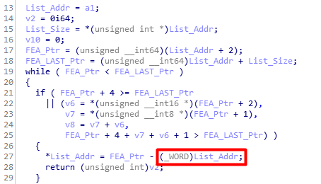

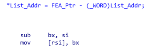

FEALIST的结构大概是这样的:
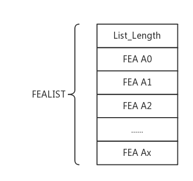

Srv!SrvOs2FeaListSizeToNt函数的逻辑是: 通过List_Addr+List_Length获取到FEALIST的最后指针地址，接着遍历所有FEA指针直到FEA指针到达或超过最后指针的地址，然后用FEA指针减去FEALIST_Addr从而获取长度。该长度会覆盖一开始的List_Length。这里问题所在就是**长度覆盖一开始的List_Length时使用前后不一致的数据长度前缀**，代码中减数的数据长度前缀为WORD，而被减数没有设置数据长度前缀，它是int型，在计算机中就是DWORD。当有一个操作数的数据长度前缀为WORD时，整个指令就按照WORD来执行，意味着被减数只有WORD的部分受影响，而DWORD高位的一半不受影响。这个sub的结果存在[rsi],[rsi]的作为Os2LeaList的大小，会在后面的代码用到。

使用Windbg进行内核调试，在上面错误发生地址下断点:
```
bp srv!SrvOs2FeaListSizeToNt+0x74
```
然后在metasploit中依次执行以下指令:

```
use exploit/windows/smb/ms17_010_eternalblue
set rhost xxx.xxx.xxx.xxx (被攻击机ip)
exploit
```
Windbg执行到断点处就会停下:


分别查看bx和rsi地址的值:

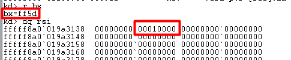

这里的[rsi]本应该是0xff5d,但是错误地变成了**0x1ff5d**。
srv!SrvOs2FeaListSizeToNt的返回值是NtFeaList的大小，作为后面会调用的**SrvAllocateNonPagedPool**函数的参数分配对应pool的大小，这里得到的NtFeaList Size是0x10fe8:

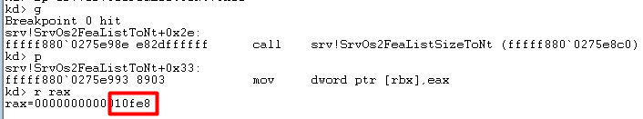

0x10fe8比上面通过漏洞得到的Os2LeaList Size(0x1ff5d)小，导致后面循环调用Srv!SrvOs2FeaToNt(这个函数用于将一个Os2Fea转换为NtFea)时会跨越**SrvAllocateNonPagedPool**函数分配的pool。


### 栈回溯

使用栈回溯的方法确定memmove修改了哪个重要的部分。首先在payload的最前面加上**0xcc**使Windbg在执行shellcode前断下。接下来使用指令**k**查看函数调用栈:


可以看到shellcode的地址为**0xffffffff\`ffd00201**，其上面有两层srvnet的父函数。srvnet!SrvNetCommonReceiveHandler+0xbb在IDA里表示如下call:

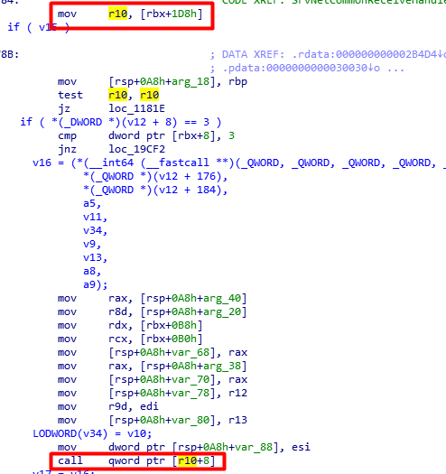

可以根据 [r10+8] == **0xffffffff\`ffd00201** 得到r10的值，进而逆推出上面[rbx+0x1d8]的值。在srvnet!SrvNetCommonReceiveHandler+0xb7处下断点 (图中+0xbb是call的下条指令的地址):
```
bp srvnet!SrvNetCommonReceiveHandler+0xbb "j poi(r10+8) == 0xffffffffffd00201 '';'gc'"
```
重新执行shellcode，得到r10的值**0xffffffff\`ffd001f0**:

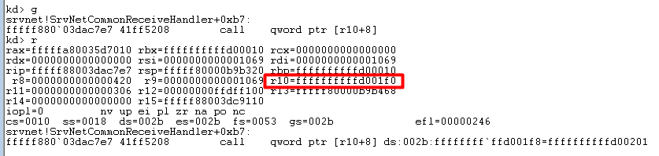

类似地，在 mov r10,[rbx+0x1d8] 处下断点直到[rbx+0x1d8] == **0xffffffff\`ffd001f0**，得到rbx == **0xffffffff\`ffd00010**:


而rbx是作为srvnet!SrvNetCommonReceiveHandler第一个参数被传入函数中的，所以下断点在上层函数**srvnet!SrvNetWskReceiveComplete**中调用srvnet!SrvNetCommonReceiveHandler的地方:
```
bp srvnet!SrvNetWskReceiveComplete+0x10c "j @rcx == 0xffffffffffd00010 '';'gc'"
```
rcx的值在**srvnet!SrvNetWskReceiveComplete**函数中最早是由 [r8+0x48] 传值的,在相应的地方下断点即可。

rcx的传值过程:


==========>

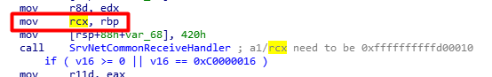

下断点指令如下:
```
bp srvnet!SrvNetWskReceiveComplete+0xa "j poi(r8+0x48) == 0xffffffffffd00010 '';'gc'"
```
再次重新执行shellcode，得到r8的值如下:

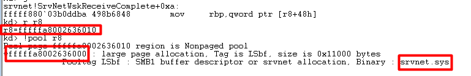

r8距离srvnet pool的偏移量为-0x10,存在如下关系:
\[r8-0x10 == addr(srvnet\ pool)\]
\[r8+0x48 == addr(srvnet\ pool)+0x58\]

根据metasploit的描述，下断点观察Srv!SrvOs2FeaToNt函数中的memmove，断点指令:
```
bp srv!SrvOs2FeaToNt+0x5a "j @r8!=0 '';'gc'"
```
当程序被断下来时，状态如下:

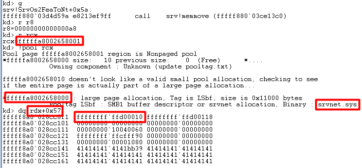

mememove遵循64位寄存器传参的调用规则，即memmove(rcx,rdx,r8)。rcx距离srvnet pool的偏移量为-0x1，[rdx+0x57]存放着跟踪的数据**0xffffffff\`ffd00010**。当数据复制完成后，存在如下关系:
\[rcx-0x1 == addr(srvnet\ pool)\]
\[rcx+0x57 == addr(srvnet\ pool)+0x58\]
结合srvnet!SrvNetWskReceiveComplete的关系式，可以知道Srv!SrvOs2FeaToNt函数中的memmove将**addr(srvnet pool)+0x58**处的值覆盖为**0xffffffff\`ffd00010**，使系统执行两个SrvNet中的函数时**错误地使用了这个结构体的地址以及里面的伪造项**，最终执行shellcode的方式就是调用了这个结构体中的一项。

地址的关系:

0xffffffff\`ffd00010+0x1d8 = 0xffffffff\`ffd001e8

Address | Value
:-: | :-:
0xffffffff\`ffd001e8 | 0xffffffff\`ffd001f0
0xffffffff\`ffd001f0 | Random
0xffffffff\`ffd001f8 | 0xffffffff\`ffd00200
0xffffffff\`ffd00200 | shellcode

### 为什么不开启两个断点在一次shellcode执行中调试
同时开启两个断点，在一次shellcode执行中调试会发生如下错误:

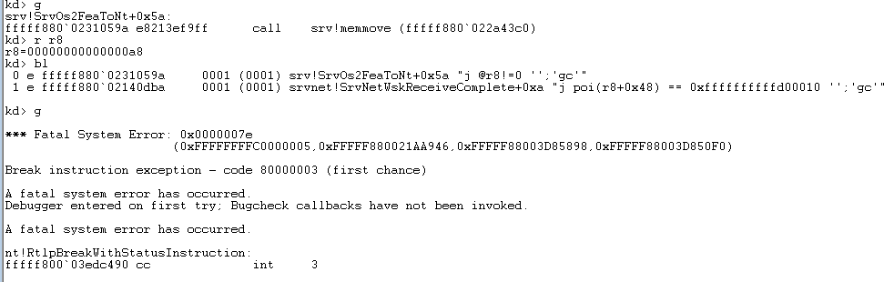

目前的水平还无法解决该问题。

# BUG2

BUG2 发生在SMB协议中。当使用SMB协议传输文件时，有两种数据传输方式:

1.**SMB_COM_TRANSACTION2**
2.**SMB_COM_NT_TRANSACT**

当上述两种传输方式的数据包太大时，协议使用SECONDARY来承接后面的数据，如**SMB_COM_TRANSACTION2_SECONDARY**和**SMB_COM_NT_TRANSACT_SECONDARY**。

协议的漏洞在于它**根据SECONDARY来判断使用的是哪种传输方式，而不判断第一个数据包**。这意味着我们使用SMB_COM_NT_TRANSACT后面连接着SMB_COM_TRANSACTION2_SECONDARY的话，SMB_COM_NT_TRANSACT会被协议处理程序误以为是SMB_COM_TRANSACTION2。下图为wireshark抓包情况:

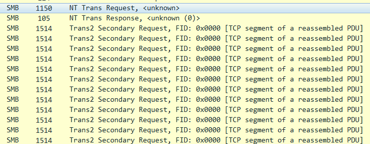


SMB_COM_NT_TRANSACT 可传输的数据大小上限为0xFFFFFFFF,而SMB_COM_TRANSACTION2的数据大小上限只为0xFFFF。BUG1中的**Srv!SrvOs2FeaListSizeToNt函数**是在传输方式为SMB_COM_TRANSACTION2的情况下才调用的，size默认为0xFFFF，所以BUG1触发的地方被减数可以不写WORD标识。但是由于我们实际上使用了SMB_COM_NT_TRANSACT传输超过0xFFFF的数据，最终导致BUG1的发生。

# BUG3

**SMB_COM_SESSION_SETUP_ANDX** 用于用户身份认证，是SMB协议中必不可少的环节。**SMB_COM_SESSION_SETUP_ANDX** 请求包有两种格式，分别是**Extended Security** 和 **NT Security**:
```
// NT Security (WordCount 13)
SMB_Parameters                                                 
  {
  UCHAR  WordCount;
  Words
    {
    UCHAR  AndXCommand;
    UCHAR  AndXReserved;
    USHORT AndXOffset;
    USHORT MaxBufferSize;
    USHORT MaxMpxCount;
    USHORT VcNumber;
    ULONG  SessionKey;
    USHORT OEMPasswordLen;
    USHORT UnicodePasswordLen;
    ULONG  Reserved;
    ULONG  Capabilities;
    }
  }
SMB_Data
  {
  USHORT ByteCount;
  Bytes
    {
    UCHAR      OEMPassword[];
    UCHAR      UnicodePassword[];
    UCHAR      Pad[];
    SMB_STRING AccountName[];
    SMB_STRING PrimaryDomain[];
    SMB_STRING NativeOS[];
    SMB_STRING NativeLanMan[];
    }
  }
```
```
// Extended Security (WordCount 12)
SMB_Parameters
   {
   UCHAR  WordCount;
   Words
     {
     UCHAR  AndXCommand;
     UCHAR  AndXReserved;
     USHORT AndXOffset;
     USHORT MaxBufferSize;
     USHORT MaxMpxCount;
     USHORT VcNumber;
     ULONG  SessionKey;
     USHORT SecurityBlobLength;
     ULONG  Reserved;
     ULONG  Capabilities;
     }
   }
 SMB_Data
   {
   USHORT ByteCount;
   Bytes
     {
     UCHAR      SecurityBlob[SecurityBlobLength];
     SMB_STRING NativeOS[];
     SMB_STRING NativeLanMan[];
     }
   }

```

协议代码会通过**BlockingSessionSetupAndX**函数判断是 **Extended Security** 模式还是 **NT Security** 模式:

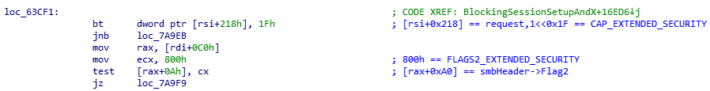

其伪代码大概如下:
```
if((request->Capabilities & CAP_EXTENDED_SECURITY) && (smbHeader->Flag2 & FLAGS2_EXTENDED_SECURITY)){
	GetExtendedSecurityParameters();
	...
}
else{
	GetNtSecurityParameters();
	...
}
```


一般情况下，如果是**Extended Security**模式的话，**if((request->Capabilities & CAP_EXTENDED_SECURITY) && (smbHeader->Flag2 & FLAGS2_EXTENDED_SECURITY))** 肯定是成立的。但是可以伪造数据包，将 **FLAGS2_EXTENDED_SECURITY** 位设置为0，那么本来是**Extended Security**模式的结构体会错误地使用函数**GetNtSecurityParameters**解析。

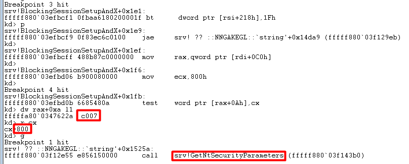

由上图可以看到:**request->Capabilities & CAP_EXTENDED_SECURITY** 条件成立，但是由于smbHeader->Flag2([rax+0Ah])没有设置**FLAGS2_EXTENDED_SECURITY**位(0x800),所以结构体虽然是**Extended Security**模式，但是最终调用函数**GetNtSecurityParameters**，以**NT Security**模式解析结构体。
**GetNtSecurityParameters** 内部会计算结构体中NativeOS和NativeLanMan的大小，在函数结束后调用**SrvAllocateSecurityContext** 为它们分配空间:

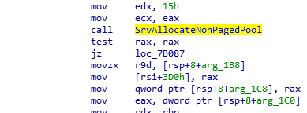


**Extended Security** 和 **NT Security** 模式中的ByteCount用于存储SMB_DATA中一共用了多少字节(除了ByteCount自己)。由于使用错误的函数解析结构体，**Extended Security** 的ByteCount被解析为错误的偏移(偏移至SecurityBlob和NativeOS处)。因此，可以构造NativeOS，在调用**SrvAllocateSecurityContext**时实现任意大小分配。

将metasploit中NativeOS的值分别改为0x1234和0xabcd:

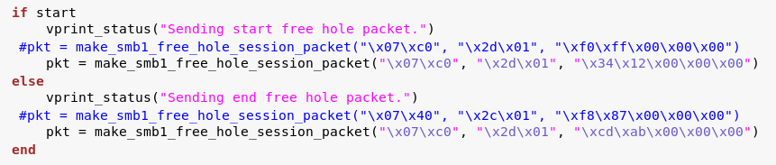

在**call SrvAllocateSecurityContext**处下断点并检查rcx(第一参数)的值:

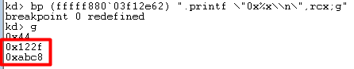


# Grooming

要精确地由srv pool 溢出到srvnet pool, 需要使用Grooming技术。
