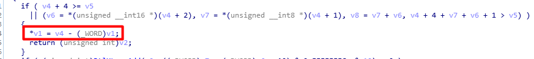
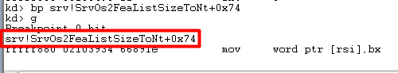
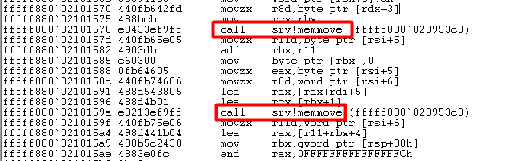
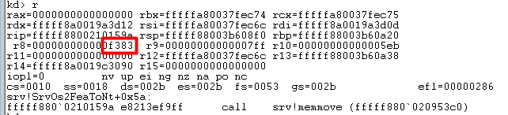
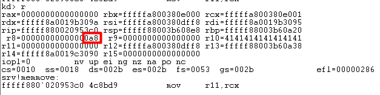
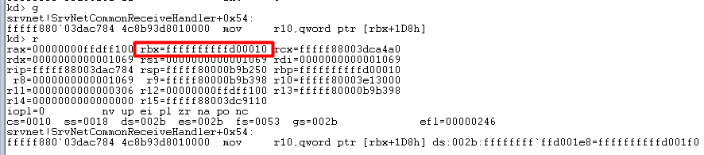
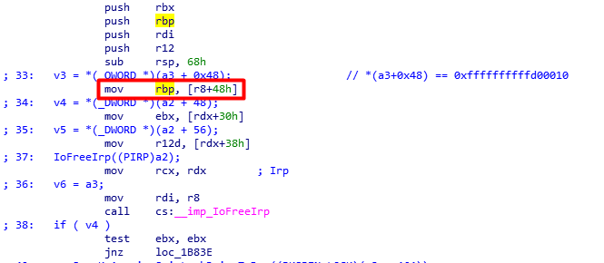

# MS17_010
## Summary
MS17_010，Eternalblue(永恒之蓝)
## Analyze
根据matesploit的exploit攻击脚本，漏洞发生在函数Srv!SrvOs2FeaListSizeToNt中。该函数在一个地方错误地将本应该为_DWORD的地方写成了_WORD，导致数据传递错误:
```
// matesploit中的描述
The size is calculated in Srv!SrvOs2FeaListSizeToNt, with mathematical error where a DWORD is subtracted into a WORD.
```
使用IDA打开srv.sys，找到Srv!SrvOs2FeaListSizeToNt函数，可以看到确实存在如matesploit所描述的错误:



使用Windbg进行内核调试，在上面错误发生地址下断点:
```
bp srv!SrvOs2FeaListSizeToNt+0x74
```
然后在metasploit中依次执行以下指令:

```
use exploit/windows/smb/ms17_010_eternalblue
set rhost xxx.xxx.xxx.xxx (被攻击机ip)
exploit
```
Windbg执行到断点处就会停下:



分别查看bx和rsi地址的值:


这里的[rsi]本应该是0xff5d,但是错误地使用了_WORD,所以变成了**0x1ff5d**。

metasploit显示缓冲区溢出发生在Srv!SrvOs2FeaToNt函数中的memmove:
```
There is a buffer overflow memmove operation in Srv!SrvOs2FeaToNt.
```
Srv!SrvOs2FeaToNt函数有两处memmove:


但是其中有不少memmove的size都为0，即没有发生内存数据移动。所以需要下断点如下:

```
bp Srv!SrvOs2FeaToNt+0x38 "j @r8!=0 '';'gc'"
bp Srv!SrvOs2FeaToNt+0x5a "j @r8!=0 '';'gc'"
```

继续跑起来，最终发现Windbg分别断在了size = 0xf383 和size = 0xa8 上:

 


使用栈回溯的方法确定memmove修改了哪个重要的部分。首先在payload的最前面加上**0xcc**使Windbg在执行shellcode前断下。接下来使用指令**k**查看函数调用栈:

可以看到shellcode的地址为**0xffffffff\`ffd00201**，其上面有两层srvnet的父函数。srvnet!SrvNetCommonReceiveHandler+0xbb在IDA里表示如下call:

可以根据 [r10+8] == **0xffffffff\`ffd00201** 得到r10的值，进而逆推出上面[rbx+0x1d8]的值。在srvnet!SrvNetCommonReceiveHandler+0xb7处下断点 (图中+0xbb是call的下条指令的地址):
```
bp srvnet!SrvNetCommonReceiveHandler+0xbb "j poi(r10+8) == 0xffffffffffd00201 '';'gc'"
```
重新执行shellcode，得到r10的值**0xffffffffffd001f0**:

类似地，在 mov r10,[rbx+0x1d8] 处下断点直到[rbx+0x1d8] == **0xffffffffffd001f0**，得到rbx == **0xffffffffffd00010**:

而rbx是作为srvnet!SrvNetCommonReceiveHandler第一个参数被传入函数中的，所以下断点在上层函数**srvnet!SrvNetWskReceiveComplete**中调用srvnet!SrvNetCommonReceiveHandler的地方:
```
bp srvnet!SrvNetWskReceiveComplete+0x10c "j @rcx == 0xffffffffffd00010 '';'gc'"
```
rcx的值在**srvnet!SrvNetWskReceiveComplete**函数中最早是由 [r8+0x48] 传值的,所以在相应的地方下断点即可。

rcx的传值过程:


==========>



所以下断点指令如下:
```
bp srvnet!SrvNetWskReceiveComplete+0xa "j poi(r8+0x48) == 0xffffffffffd00010 '';'gc'"
```
再次重新执行shellcode，得到r8+0x48 == **0x**:

srv!SrvOs2FeaToNt+0x5a "j @r8!=0 '';'gc'"
srvnet!SrvNetWskReceiveComplete+0xa "j poi(r8+0x48) == 0xffffffffffd00010 '';'gc'"
