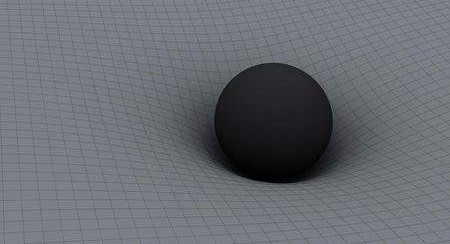

# Supermassive black holes(未完)

## Introduction

最近看了BBC的纪录片《*Horizon: Who's Afraid of a Big Black Hole?*》，作为一个伪天文爱好者，总结一下自己学到了什么。

## Test

欠缺器材，无法测试。

所需器材 | 数量
:-: | :-:
天文望远镜 | 一台
能进入黑洞并发送回数据的传感器 | 若干
时间 | 几十年
智商 | 140以上

## Summary

### 黑洞的概念
黑洞是*恒星衰老死亡(内部核聚变结束)后，在自身重力作用下坍塌形成的一个质量极大而体积极小的奇点*。

### 黑洞的发现
#### 广义相对论
1916年，爱因斯坦发表广义相对论，首次解释了引力的存在原理:**天体的质量会使时间和空间扭曲**。质量越大，对时间/空间的扭曲程度越大，而时空的扭曲程度会影响星体的运动轨迹，看上去就像有一股力拉着星体。

如上图所示，想象时空是一张“海绵床”，将一定质量的天体放下去就会使"海绵床"下陷。当有其它质量较小的天体在附近时，就会绕着下陷的曲面运动。如果速度不够快，环绕天体会越来越接近中心天体，最终被中心天体吸入。(类似于离心运动?)

爱因斯坦提出的引力场方程被用来描述这种时空弯曲的情况。这个方程式的左边表达的是时空的弯曲情况(时空曲率)，而右边则表达的是物质及其运动。
引力场方程:
$$G_{\mu\nu}=R_{\mu\nu}-\frac{1}{2}g_{\mu\nu}R=\frac{8\pi G}{c^4}T_{\mu\nu}$$

#### Schwarzschild metric

1916年，德国天文学家Karl Schwarzschild通过计算得到了爱因斯坦引力场方程的一个真空解:
$$c^2d\tau^2 = (1-\frac{r_s}{r})c^2dt^2-(1-\frac{r_s}{r})^{-1}dr^2-r^2(d\theta^2+sin^2\theta d\varphi^2)$$
这个解被称为Schwarzschild metric，表明如果将大量物质集中于空间一点，其周围会产生奇异的现象，即在质点周围存在一个界面——“Event horizon”(视界)。一旦进入这个界面，即使光也无法逃脱。

### 坐标系选取问题

Schwarzschild metric有个问题，就是当r=0或者r = rs时，有的项会变为无穷，最终计算出的**空间曲率为无穷**! 后来发现当r = rs时，时空曲率为无穷是因为坐标系选取的不当而导致的。当更换为其它坐标系后，r = rs 出现的问题就解决了。所以计算空间曲率需要使用一个“与坐标系无关”的公式，Kretschmann invariant:
$$K = R^{\alpha\beta\gamma\delta}R_{\alpha\beta\gamma\delta}=\frac{12r_s^2}{r^6}=\frac{48G^2M^2}{c^4r^6}$$

### r=0

广义相对论中阐述了黑洞中心是一个体积无限小的奇点，其半径r=0。使用 Kretschmann invariant 计算黑洞的时空曲率可以发现其**时空曲率为无穷**，这相对于r = rs是物理上的奇点。由于时空曲率之大即时空扭曲程度之高，导致连光都无法逃脱，所以称之为“黑洞”。

### Event horizon

我们知道要逃离一个星体，首先要达到逃逸速度:
$$V = \sqrt{\frac{2GM}{R}}$$

物体之间存在万有引力:
$$F = \frac{Gm_1m_2}{r^2}$$
$$G=6.67259×10^{-11} N·m^2/kg^2$$

黑洞具有巨大的质量，意味着对其它物体有巨大的引力，导致物体即使达到光速都无法逃离黑洞。在这个无法逃离黑洞的距离以内就叫做Event horizon(视界)。进入Event horizon之后，光也无法无法逃离黑洞。Event horizon的半径又称为Schwarzschild radius,其计算方式如下:
$$r_s = \frac{2GM}{c^2}$$
$$EARTH: r_s = \frac{2*6.67259*10^{-11}*5.965*10^{24}}{299792458^2}=0.0089m$$
$$SUN:r_s=\frac{2*6.67259*10^{-11}*1.9891*10^{30}}{299792458^2}*=2953.5m$$

### 星系中央黑洞

大部分星系的中心是一个超大质量黑洞，支撑着整个星系的旋转(我认为)。由于不断有天体被吸收进去，星系中心的黑洞质量不断增加，导致引力越来越大，视界范围越来越大，就有越来越多的天体被吸入，不断循环。

下面作质量对比:
地球质量 == m0，太阳质量 == m1，银河系中央黑洞质量 == m2。

$$m_0 = 5.965*10^{24}kg$$
$$m_1 = 333445*m_0$$
$$m_2 = 4300000*m_1 = 1433813500000*m_0$$

Schwarzschild radius公式暗示着视界半径与天体质量成正比，所以银河系中央黑洞的Schwarzschild radius为:
$$r_{s2} = 4300000*r_{s1} = 12700050km$$

然而，银河系中央黑洞的质量并不算大，有的星系中央黑洞的质量甚至达到了太阳质量的数十亿倍! 可见星系中央黑洞质量之大，半径之长。
